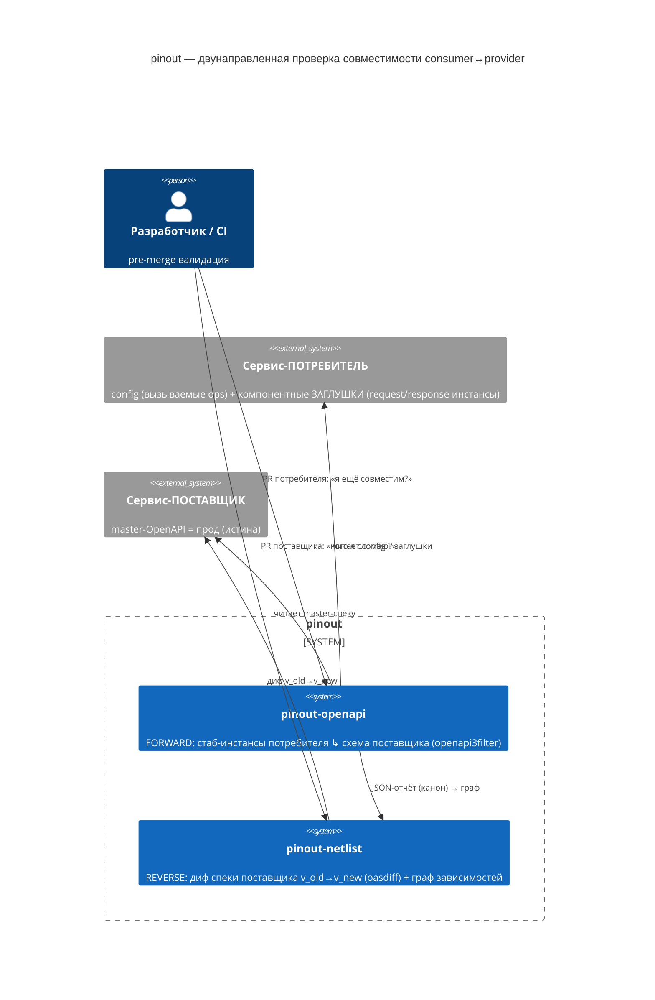
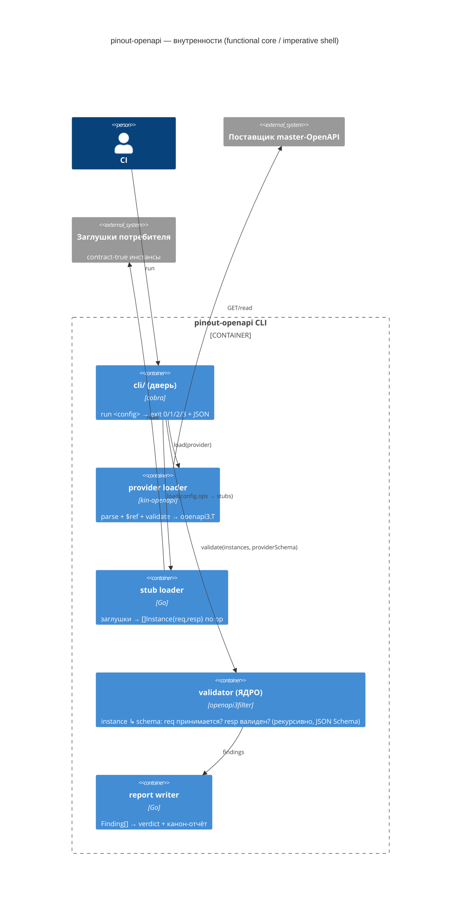

# pinout-openapi — концепт дизайна (как инструмент должен работать)

> Reference для чтения (не вход харнеса — БТ в [`../TASK.md`](../TASK.md), дизайн-пакет харнес кладёт в
> `docs/design/slice-*/`). Фиксирует **исправленную модель**: проверка совместимости пары
> consumer↔provider в двух направлениях.

**Несущий инвариант экосистемы:** каждый сервис конформен своей спеке (доказано его компонентными
тестами) ⇒ структурная совместимость спек-пары = реальная совместимость сервисов.
**Источник истины — спека ПОСТАВЩИКА.** Ожидание потребителя живёт в его **компонентных заглушках**
(contract-true инстансы: какой request он шлёт, какой response ждёт), а не в отдельной «ожидаемой спеке».

---

## C4 — System Context



## C4 — Container (pinout-openapi, forward)



---

## Алгоритм FORWARD — потребитель → поставщик (`pinout-openapi`)

Чистая ROP-труба; шаги короткозамыкаются (первый провал → отчёт), `incompatible` — вердикт, не ошибка:

```
checkConsumerToProvider(config) -> Result<Report, Error>:
  | loadProviderSpec(config.provider)                 -> ProviderSpec   # kin-openapi parse+$ref+validate; fail → PROVIDER_*/SPEC_*
  | resolveOps(config.operations, ProviderSpec)       -> []Op           # каждая config-op ЕСТЬ у поставщика; нет → OP_NOT_IN_PROVIDER
  | loadStubs(config.consumer.stubs, Ops)             -> []Stub         # инстансы {op, request, expectedResponse}; нет заглушки → STUB_MISSING
  | flatMap(Stubs, validateAgainstSchema)             -> []Finding      # ЯДРО, per stub:
  |     validateRequest(stub.request , op.requestSchema)          -> []Finding  #  поставщик ПРИНИМАЕТ запрос? (контравариантно)
  |     validateResponse(stub.expectedResponse, op.responseSchema)-> []Finding  #  ожидаемый ответ ВАЛИДЕН по схеме? (ковариантно)
  |         # openapi3filter рекурсивен → вложенность/типы/enum/format/nullable — ДАРОМ
  | aggregate(Findings)                               -> Verdict        # findings≥1 ⇒ incompatible
  | buildReport(Verdict, Findings, meta)              -> Report         # exit 0 compatible | 1 incompatible; stdout + файл
```

**Триггер:** PR потребителя. **Смысл:** «моё использование (заглушки) всё ещё ложится на текущую схему
поставщика?» Глубина сравнения встроена в `openapi3filter` — отдельной «v2 глубокого сравнения» не нужно.

## Алгоритм REVERSE — поставщик меняет контракт → кто сломается (`pinout-netlist`)

Здесь **oasdiff уместен** (две версии ОДНОЙ спеки поставщика) + граф зависимостей:

```
detectBreakingImpact(providerNew) -> Result<ImpactReport, Error>:
  | fetchPrevious(provider.id)                        -> ProviderOld    # предыдущая master-версия из графа
  | oasdiff.breaking(base=ProviderOld, rev=providerNew) -> []Breaking   # диф во времени: type/enum/required/nullable/removed — deep
  | map(Breaking, affectedOp)                         -> Set<Op>        # какие операции сломались breaking-образом
  | queryGraph(AffectedOps)                           -> []Dependency   # кто зависит от этих ops (рёбра consumer→provider@op)
  | map(Dependency, resolveConsumer)                  -> []Impact       # {consumer, op, что сломалось}
  | filter(Impacts, stillLive)                        -> []Impact       # только ЖИВУЩИЕ потребители
  | buildImpactReport(Impacts)                        -> ImpactReport   # «v_new ломает: consumer-X на op A (type-drift)…» — гейт мержа поставщика
```

**Триггер:** PR поставщика. **Смысл:** «сломает ли это изменение контракта кого-то из уже
интегрированных потребителей?»

---

## Дуальность (полная картина)

| | FORWARD (`pinout-openapi`) | REVERSE (`pinout-netlist`) |
|---|---|---|
| Триггер | PR **потребителя** | PR **поставщика** |
| Вопрос | «я совместим с провайдером СЕЙЧАС?» | «кого я сломаю ЭТИМ изменением?» |
| Вход | provider-схема + config + **заглушки потребителя** | provider **v_old→v_new** + граф |
| Механизм | `openapi3filter` (instance ↳ schema) | `oasdiff` (spec ↳ spec) + граф |
| Глубина сравнения | даром от JSON-Schema-валидации kin-openapi | даром от oasdiff |
| Роль в экосистеме | связывает **пару сейчас** | связывает **историю во времени** |

Оба стоят на: **provider-спека = истина**; потребитель конформен через свои заглушки/тесты.

## Открытые вопросы (проработка позже)

1. Формат/расположение заглушек потребителя; извлечение request+expectedResponse из инстанса.
2. Что валидировать в запросе (path/query/headers/body) и маппинг заглушки на операцию (path+method).
3. Режимы отказа → exit-коды + `error.code` (compatible/incompatible/OP_NOT_IN_PROVIDER/STUB_MISSING/spec-I/O…).
4. Поставщик: `spec_url`/`spec_path`/оба; auth к приватному git; таймаут.
5. Формат отчёта — канон с `pinout-asyncapi` (+`schema_version` для netlist).
6. Границы MVP.
