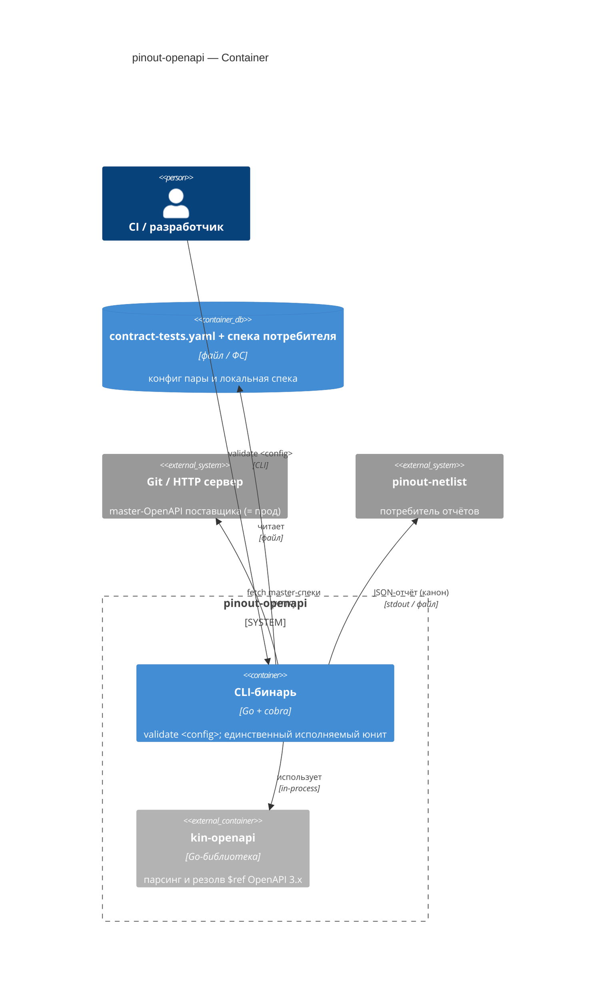
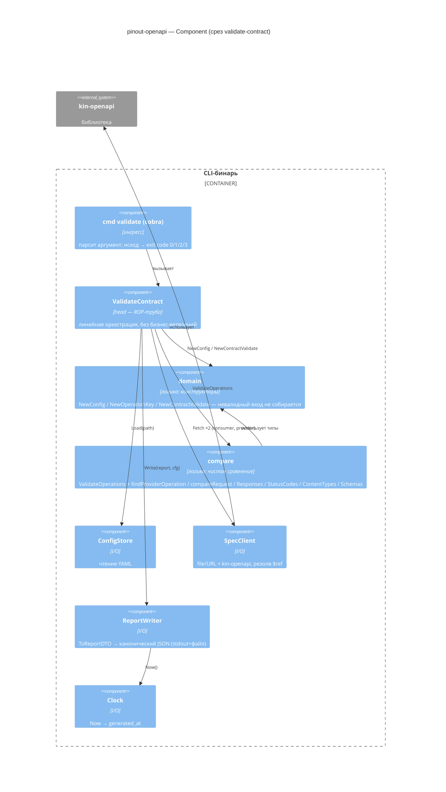

# C4 — концептуальный дизайн pinout-openapi

Уровни C4 для среза `validate-contract`. Диаграммы на Mermaid — рендерятся прямо в GitHub (блок ` ```mermaid `, без плагинов). C1 (System Context экосистемы) — в [концепте pinout](../../../../pinout/README.md). C4 (код) не рисуем — это сигнатуры в [`impl-brief-01.md`](./impl-brief-01.md).

## C2 — Container

Один развёртываемый юнит (CLI-бинарь) + библиотека `kin-openapi` (honest reuse).



## C3 — Component (= дерево модулей среза `validate-contract`)

Зависимости направлены внутрь: ингресс → head → {логика, I/O}. Логика не знает о cobra/http/os/time; I/O реализует интерфейсы, объявленные в head.



**Поток по трубе head:** `cmd` → `ValidateContract` → `ConfigStore.Load` → `NewConfig` → `SpecClient.Fetch ×2` → `NewContractValidate` → `ValidateOperations` → `ReportWriter.Write` → exit code. Первый `Err` (конфиг/спека) коротит трубу; несовместимость — это `Report` с `compatible=false`, не `Err`. Подробности — [`slices/01-validate-contract.md`](./slices/01-validate-contract.md).

---

## Системный use case (Cockburn, fully dressed)

**UC-1 · Проверить совместимость контрактов потребителя и поставщика**

| Поле | Значение |
|---|---|
| **Scope** | `pinout-openapi` — CLI-валидатор синхронных контрактов |
| **Level** | User-goal (sea level) |
| **Primary Actor** | CI-пайплайн потребителя (pre-merge); вторично — разработчик локально |
| **Trigger** | Запуск `validate <contract-tests.yaml>` в шаге CI до merge |

**Stakeholders & Interests**
- *Потребитель / его CI* — узнать до merge, что код совместим с прод-контрактом поставщика; быстрый детерминированный вердикт.
- *Поставщик* — чтобы потребители не ломались о его контракт; master-спека = источник истины.
- *`pinout-netlist`* — получить отчёт в каноническом JSON для графа зависимостей.
- *Оператор экосистемы* — машиночитаемая диагностика без ложной уверенности.

**Preconditions**
- Существует `contract-tests.yaml` со ссылками на спеку потребителя и master-спеку поставщика и перечнем операций.
- master-спека поставщика доступна (файл/URL).
- Несущий инвариант: каждый сервис конформен собственной спеке (его компонентными тестами).

**Minimal Guarantee** — всегда однозначный exit code и, при возможности, диагностика (`ValidationError`: код+сообщение+локация); никогда «совместимо» при необработанной ошибке.

**Success Guarantee** — вердикт совместимости вычислен корректно и записан каноническим JSON-отчётом (stdout + файл); exit code отражает исход.

**Main Success Scenario**
1. Актор запускает `validate <config>`.
2. Система читает и валидирует конфиг, собирает `Config`.
3. Загружает спеку потребителя, парсит, резолвит локальные `$ref`.
4. Загружает master-спеку поставщика, парсит.
5. Для каждой операции находит соответствие у поставщика по `path`+`method`.
6. Сверяет request, response (provider ⊇ consumer), коды успеха, content-type, рекурсивно схемы.
7. Все операции совместимы → формирует отчёт `compatible=true` (канон JSON), пишет stdout+файл (`generated_at` от часов).
8. Завершает с **exit 0**.

**Extensions**
- **2a.** Конфиг отсутствует/невалиден → `CONFIG_NOT_FOUND`/`CONFIG_INVALID` → **exit 2**.
- **2b.** Операция конфига отсутствует в спеке самого потребителя → `CONSUMER_OPERATION_NOT_FOUND` → **exit 2**.
- **3a/4a.** Спека недоступна/не парсится (вкл. внешний `$ref`) → `SPEC_UNREACHABLE`/`SPEC_NOT_FOUND`/`SPEC_PARSE_ERROR` → **exit 3**.
- **5a.** Операции нет у поставщика → `OPERATION_NOT_FOUND`, вердикт `compatible=false`, прогон продолжается → **exit 1**.
- **6a.** Несовместимость → `REQUEST_INCOMPATIBLE`/`RESPONSE_INCOMPATIBLE`/`STATUS_MISMATCH`/`CONTENT_TYPE_MISMATCH` → **exit 1**.
- **6b.** Рекурсивная схема → детект цикла памятью пар завершает обход без зависания, сравнение продолжается.
- **7a.** Не удалось записать отчёт → ненулевой exit (вердикт вычислен, но не доставлен).

**Technology & Data Variations** — источник спеки: файл (`spec_path`) или URL (`spec_url`); парсер `kin-openapi`; вывод: stdout всегда, файл по `settings.save_json_report`.

**Related** — частота: на каждый pre-merge билд потребителя. Границы/непокрытое — [`../../risk-coverage.md`](../../risk-coverage.md). Симметричный async-сценарий — `pinout-asyncapi`.
