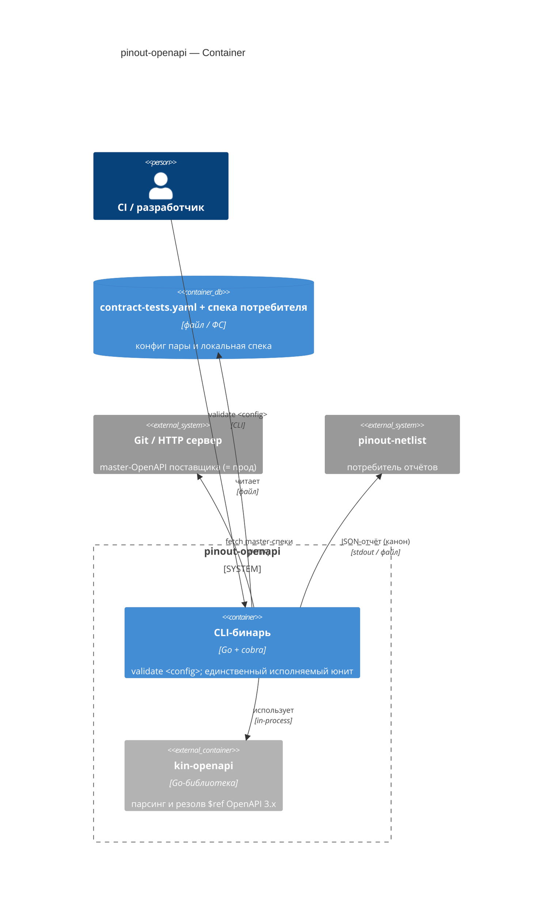
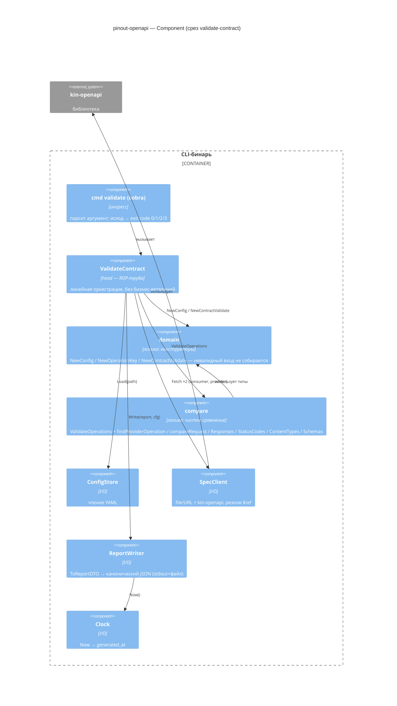

# C4 — концептуальный дизайн pinout-openapi

Уровни C4 для среза `validate-contract`. Диаграммы на Mermaid — рендерятся прямо в GitHub (блок ` ```mermaid `, без плагинов). C1 (System Context экосистемы) — в [концепте pinout](../../../../pinout/README.md). C4 (код) не рисуем — это сигнатуры в [`impl-brief-01.md`](./impl-brief-01.md).

## C2 — Container

Один развёртываемый юнит (CLI-бинарь) + библиотека `kin-openapi` (honest reuse).



## C3 — Component (= дерево модулей среза `validate-contract`)

Зависимости направлены внутрь: ингресс → head → {логика, I/O}. Логика не знает о cobra/http/os/time; I/O реализует интерфейсы, объявленные в head.



**Поток по трубе head:** `cmd` → `ValidateContract` → `ConfigStore.Load` → `NewConfig` → `SpecClient.Fetch ×2` → `NewContractValidate` → `ValidateOperations` → `ReportWriter.Write` → exit code. Первый `Err` (конфиг/спека) коротит трубу; несовместимость — это `Report` с `compatible=false`, не `Err`. Подробности — [`slices/01-validate-contract.md`](./slices/01-validate-contract.md).
