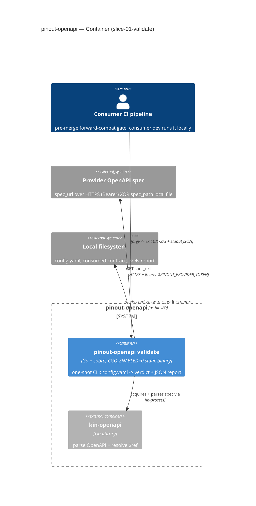
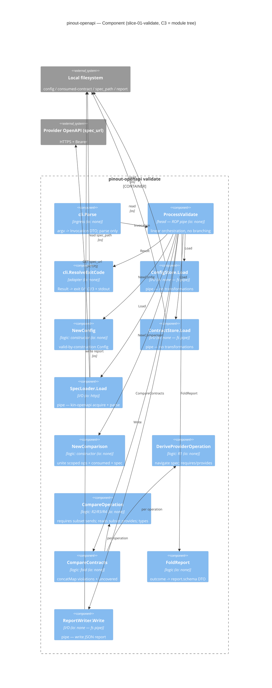

# C4 — slice-01-validate

> C2 Container + C3 Component (the C3 **is** the [`module-tree.md`](./module-tree.md) node-for-node).
> C1 (system context) → concept landing. C4 (code) → not drawn. Use case →
> [`use-case.md`](./use-case.md). Mermaid renders on GitHub without plugins.

## C2 — Container



## C3 — Component (= module tree)

Dependencies point **inward**: ingress → head → {logic, I/O}. Logic knows nothing of cobra / http /
os / time; the I/O objects are the only externally-connected components (pipes — no transformations).



**Head-pipe flow** (from `module-tree.md`):

```
cli.Parse -> ProcessValidate -> ConfigStore.Load -> NewConfig -> ContractStore.Load
  -> SpecLoader.Load -> NewComparison -> CompareContracts{DeriveProviderOperation, CompareOperation}
  -> FoldReport -> ReportWriter.Write -> cli.ResolveExitCode -> (exit code, stdout JSON)
```

- **C1** (system context) → concept landing (not drawn here).
- **C4** (code) → not drawn; signatures live in [`contracts.md`](./contracts.md).
