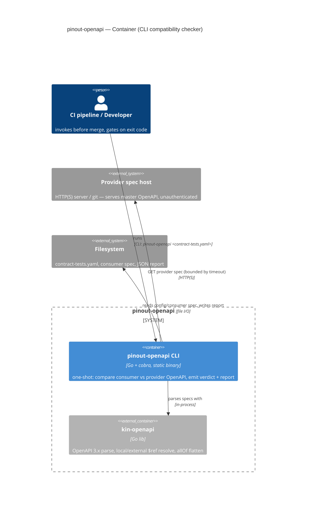
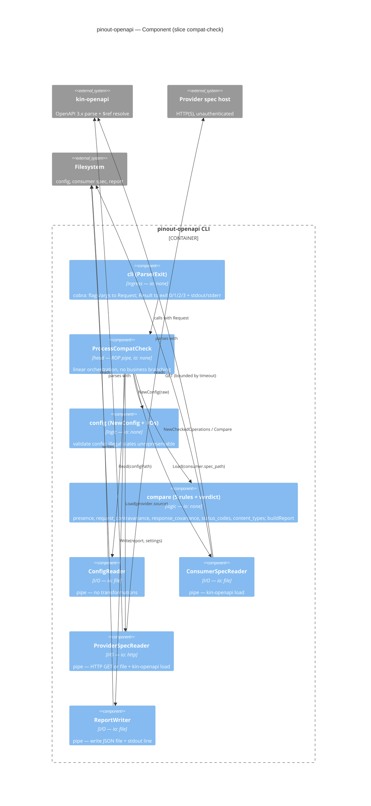

# C4 — slice `compat-check`

> Stage 9 (`c4` skill). **C2** Container + **C3** Component (= the [`module-tree.md`](./module-tree.md)
> node-for-node). C1 (system context) lives on the concept landing; C4 (code) is not drawn.
> Neighbor use case: [`use-case.md`](./use-case.md).

## C2 — Container



## C3 — Component (= the module tree)

Dependencies point **inward**: `cli` → `head` → {`config`, `spec`, `compare`, `report`}. The pure core
(`compare`, `config` constructors) knows nothing of cobra/http/os/kin-openapi; the four I/O objects are
the only externally-connected components and implement the port interfaces the head declares.



**Head-pipe flow** (from `module-tree.md`):

```
cli.Parse → ProcessCompatCheck → ConfigReader.Read → NewConfig → ConsumerSpecReader.Load
  → NewCheckedOperations → ProviderSpecReader.Load → NewComparison → Compare → ReportWriter.Write → cli.Exit
```

- C1 (system context) → concept landing (`platform-landing`); linked, not drawn here.
- C3 matches `module-tree.md` node-for-node; I/O nodes tagged `io:` + "pipe — no transformations".

<!-- DONE: moduledesigner slice-compat-check -->
</content>
